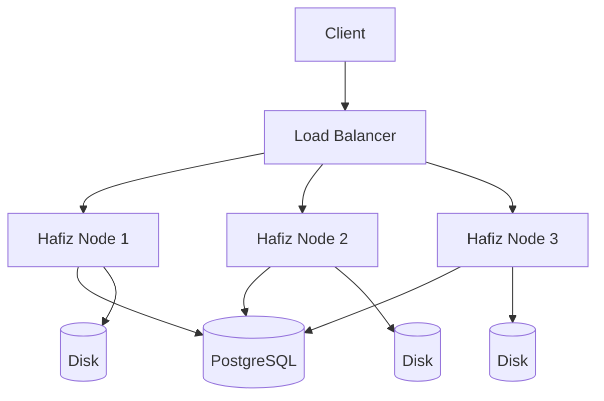

# Architecture

-   :material-view-module:{ .lg .middle } __Components__

    ---

    Crate structure and responsibilities.

    [:octicons-arrow-right-24: Components](components.md)

-   :material-shield:{ .lg .middle } __Security__

    ---

    Security model and best practices.

    [:octicons-arrow-right-24: Security](security.md)

## Overview

## Key Design Principles

1. **S3 Compatible** - Works with existing tools
2. **Memory Safe** - Written in Rust
3. **Scalable** - Horizontal scaling
4. **Secure** - Encryption at rest and in transit
5. **Observable** - Prometheus metrics
