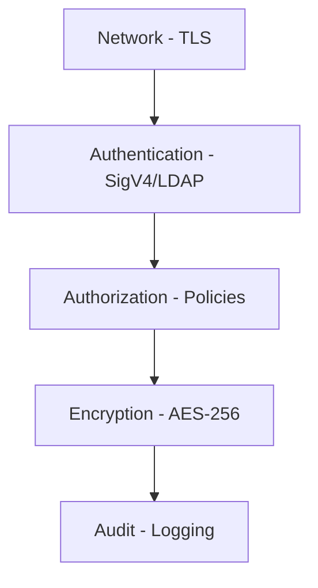

# Security Model

## Defense in Depth

## Authentication

- **AWS Signature V4** - Request signing
- **LDAP** - Enterprise integration

## Authorization

- **Bucket Policies** - IAM-style access control
- **Conditions** - IP, time, MFA

## Encryption

- **In Transit** - TLS 1.2/1.3
- **At Rest** - AES-256-GCM

## Audit

- Access logging
- Request tracing

## Best Practices

1. Enable TLS in production
2. Use strong credentials
3. Enable encryption
4. Regular key rotation
5. Monitor access logs
