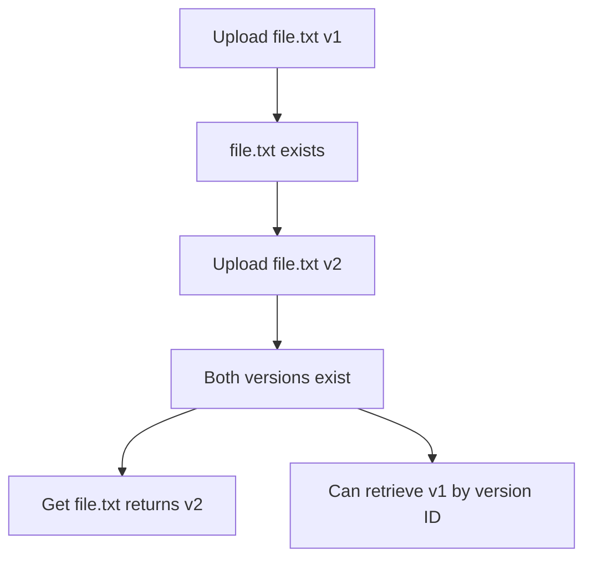

# Versioning

Versioning allows you to keep multiple versions of an object in the same bucket. This provides protection against accidental deletions and overwrites.

## Enabling Versioning

```bash
aws --endpoint-url http://localhost:9000 s3api put-bucket-versioning \
    --bucket my-bucket \
    --versioning-configuration Status=Enabled
```

## Check Versioning Status

```bash
aws --endpoint-url http://localhost:9000 s3api get-bucket-versioning \
    --bucket my-bucket
```

## How Versioning Works



## Working with Versions

### List All Versions

```bash
aws --endpoint-url http://localhost:9000 s3api list-object-versions \
    --bucket my-bucket
```

### Get Specific Version

```bash
aws --endpoint-url http://localhost:9000 s3api get-object \
    --bucket my-bucket \
    --key file.txt \
    --version-id "abc123" \
    output.txt
```

### Delete Specific Version

```bash
aws --endpoint-url http://localhost:9000 s3api delete-object \
    --bucket my-bucket \
    --key file.txt \
    --version-id "abc123"
```

## Delete Markers

When you delete an object in a versioned bucket, Hafiz creates a **delete marker** instead of permanently deleting the object.

```bash
# This creates a delete marker
aws --endpoint-url http://localhost:9000 s3 rm s3://my-bucket/file.txt

# The object appears deleted
aws --endpoint-url http://localhost:9000 s3 ls s3://my-bucket/file.txt
# (no output)

# But versions still exist
aws --endpoint-url http://localhost:9000 s3api list-object-versions \
    --bucket my-bucket --prefix file.txt
# Shows all versions + delete marker
```

### Restore Deleted Object

Delete the delete marker to restore the object:

```bash
aws --endpoint-url http://localhost:9000 s3api delete-object \
    --bucket my-bucket \
    --key file.txt \
    --version-id "delete-marker-version-id"
```

## Suspending Versioning

```bash
aws --endpoint-url http://localhost:9000 s3api put-bucket-versioning \
    --bucket my-bucket \
    --versioning-configuration Status=Suspended
```

!!! note
    Suspending versioning doesn't delete existing versions. New uploads will have `null` version ID.

## MFA Delete

For additional protection, enable MFA Delete to require multi-factor authentication for:

- Permanently deleting object versions
- Changing versioning state

!!! warning "Admin API required"
    MFA Delete configuration requires the Admin API.

## Best Practices

1. **Enable versioning early** - Turn it on before storing important data
2. **Use lifecycle rules** - Automatically delete old versions
3. **Monitor storage** - Versions consume storage space
4. **Protect with Object Lock** - Combine with WORM for compliance
